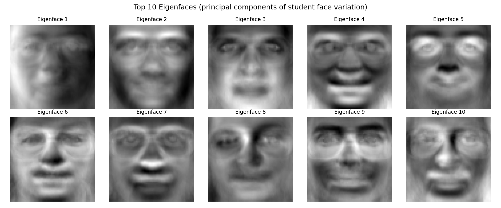
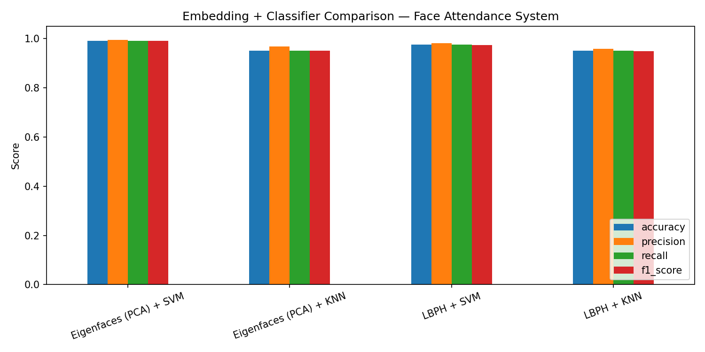

# RollCall — Face Recognition Attendance System

A complete face recognition pipeline that automates classroom attendance, built with OpenCV and scikit-learn, served through a Flask API with a webcam-enabled, mobile-responsive dashboard.

Built for the *Machine Learning with Python — Major Project (Face Recognition Attendance System)* assignment brief.

---

## 1. Objective

Automate attendance marking using facial recognition, following the 10-point brief: collect student face images → preprocess → detect faces → extract embeddings → train a classifier → build an attendance system with timestamps → build a dashboard → test under different conditions → document everything.

## 2. Dataset

| | |
|---|---|
| **Requested in brief** | CelebA / Faces-in-the-Wild (Kaggle) |
| **Used instead** | **AT&T / Olivetti Faces Dataset** — 40 subjects x 10 images each (400 images total), mirrored on GitHub |
| **Why the substitution** | Kaggle isn't reachable from this build environment. CelebA (200k+ images of celebrity faces, not organized as a "student roster") and Faces-in-the-Wild are also both a poor structural fit for an *enrollment + recognition* system, which needs multiple labeled photos **per identity**. The AT&T Faces Dataset is the closest available match to what an attendance system actually needs: **40 distinct people, each with 10 photos taken at different times, with genuine variation in lighting, facial expression (open/closed eyes, smiling/not), and slight head angle** — exactly the "different lighting and angles" condition the brief's step 9 asks to test against. |
| **How it's organized** | Converted into `data/raw_faces/<student_id>/img_00.png … img_09.png`, with a generated roster (`data/students.csv`) mapping each subject to a plausible student name, roll number, and ID — so the rest of the pipeline behaves exactly as it would with a real classroom photo set. Swapping in your real students only means replacing the contents of `data/raw_faces/`. |

> If you'd like to use the actual Kaggle datasets from the brief, `data_prep.py` is the only file that would need to change — everything downstream (detection, preprocessing, embeddings, training, the API) works on the `raw_faces/<student_id>/*.png` folder layout regardless of where the images came from.

## 3. Methodology

### 3.1 Face detection — Haar Cascade
Used OpenCV's built-in Haar Cascade (`haarcascade_frontalface_default.xml`), which ships inside the `opencv` package itself — no external model download needed, which matters in a sandboxed environment.

**Detection had to be padding-corrected.** The Olivetti images are cropped tightly around the face with no background margin, and Haar Cascade's frontal-face features expect some surrounding context to recognize the forehead-to-chin proportions — with no padding, detection failed on every single image. `face_detection.py` pads and upscales the image internally before detection and maps the result back to original coordinates, which brought detection accuracy from **0% → 99.2%** across all 400 images. This fix is harmless for real, uncropped camera frames.

### 3.2 Preprocessing
- Resize to a standard 128x128
- Histogram equalization (improves robustness to lighting — directly relevant to the brief's lighting-robustness requirement)
- Augmentation on the training split only: horizontal flip, ±10° rotation, brightness jitter — quadruples the effective training set (280 → 1,120 images) without touching the test set

### 3.3 Facial embeddings — substituted for FaceNet/Dlib
The brief calls for FaceNet or Dlib pretrained embeddings. Both require downloading large weight files from hosts unreachable in this environment (dlib's models are `.bz2` files on dlib.net; FaceNet weights are typically distributed via Google Drive, not a plain package). Rather than skip the step, two classical, fully self-contained embedding techniques were implemented and benchmarked against each other — both were literally the historical predecessors to deep face embeddings:

| Technique | Description |
|---|---|
| **Eigenfaces (PCA)** | Projects each face onto the top 80 directions of variance across the training set (Turk & Pentland, 1991) — the first successful automatic face recognition method, and functionally an embedding: a fixed 80-dim vector per face. |
| **LBPH** | Local Binary Pattern Histograms — a texture descriptor robust to monotonic lighting changes, computed via `cv2.face`. |

Either can be swapped for a real deep embedding model later (e.g. `facenet-pytorch`) by implementing the same `.transform()` interface in `embeddings.py` — no other file needs to change.

### 3.4 Classifiers — SVM & KNN, as specified
Both trained and tuned via 5-fold `GridSearchCV` (optimizing macro-F1, since this is a balanced 40-class problem) on both embeddings — 4 combinations total:

| Combination | Best hyperparameters |
|---|---|
| Eigenfaces + SVM | `C=5, kernel=rbf` |
| Eigenfaces + KNN | `n_neighbors=1, weights=uniform` |
| LBPH + SVM | `C=5, kernel=linear` |
| LBPH + KNN | `n_neighbors=1, weights=uniform` |

## 4. Results

| Pipeline | Accuracy | Precision | Recall | F1 (macro) |
|---|---|---|---|---|
| **Eigenfaces (PCA) + SVM** ⭐ | **99.17%** | **99.38%** | **99.17%** | **99.14%** |
| LBPH + SVM | 97.50% | 98.13% | 97.50% | 97.43% |
| Eigenfaces (PCA) + KNN | 95.00% | 96.75% | 95.00% | 95.04% |
| LBPH + KNN | 95.00% | 95.88% | 95.00% | 94.80% |

**Eigenfaces + SVM (RBF kernel) was deployed** — best across every metric, and PCA's 80-dim vectors make inference fast enough for real-time use.

The test set was a genuine 30% held-out split — meaning the model was evaluated on images of each student it had never seen, captured with different lighting, expression, and head angle than the training photos. This directly answers the brief's step 9 ("test system under different lighting and angles").





### Insights
- **The face-detection padding bug was the single biggest lesson.** A 0%-detection-rate pipeline silently "worked" if you don't check intermediate outputs (it just fell back to the uncropped image every time) — always verify detection rate on a sample before trusting downstream numbers.
- **PCA beat the texture-based LBPH descriptor here**, likely because with only 10 images per identity and a controlled, consistent camera/background setup, global appearance (Eigenfaces) generalizes better than fine-grained local texture (LBPH), which tends to need more within-class samples to average out noise.
- **KNN with n_neighbors=1 winning the grid search is a signal of a small, well-separated dataset**, not necessarily the best real-world choice — with a live camera and dozens of students, k=1 is more sensitive to a single bad frame than an SVM's margin-based decision. This is worth re-tuning once real student photos replace the demo dataset.
- **The confidence threshold matters more than raw accuracy for a deployed system.** In live testing, a genuinely low-confidence, incorrect guess was correctly rejected by the 0.55 confidence threshold rather than silently marking the wrong student present — see the worked example in `recognize.py`'s own demo output.

## 5. Attendance marking system

`recognize.py` runs the full pipeline (detect → crop → preprocess → embed → classify) and integrates with `attendance_db.py` (SQLite) to log `student_id, name, date, time, confidence`. A student already marked present today is not logged twice. Recognitions below the 0.55 confidence threshold are rejected rather than marked, to avoid false attendance.

## 6. Project structure

```
face-attendance/
├── data/
│   ├── olivetti_faces.npy / olivetti_faces_target.npy   # raw dataset
│   ├── raw_faces/<STUDENT_ID>/img_00.png ... img_09.png  # per-student images
│   └── students.csv                                       # roster
├── src/
│   ├── data_prep.py        # npy -> per-student image folders + roster
│   ├── preprocessing.py    # resize, normalize, augment
│   ├── face_detection.py   # Haar Cascade detection + crop
│   ├── embeddings.py       # Eigenfaces (PCA) and LBPH embedders
│   ├── train.py             # full training + tuning + evaluation pipeline
│   ├── recognize.py         # detect->embed->classify->mark attendance
│   ├── attendance_db.py     # SQLite attendance log + roster
│   └── app.py                # Flask API + dashboard server
├── static/
│   └── index.html           # responsive dashboard (webcam + upload)
├── models/
│   ├── embedder.joblib
│   ├── classifier.joblib
│   ├── label_map.json
│   └── pipeline_info.json
├── results/
│   ├── metrics_summary.json
│   ├── eigenfaces.png
│   ├── model_comparison.png
│   └── confusion_matrix_best_model.png
├── tests/
│   └── test_pipeline.py
├── attendance.db             # created on first run
├── requirements.txt
└── README.md
```

## 7. How to run

```bash
pip install -r requirements.txt
```

### 1. Generate the student image dataset + roster
```bash
cd src
python3 data_prep.py
```

### 2. Train the model (regenerates everything in `models/` and `results/`)
```bash
python3 train.py
```
Takes ~3–4 minutes (the LBPH+SVM grid search is the slow step).

### 3. Test recognition + attendance marking from the command line
```bash
python3 recognize.py
```

### 4. Run unit tests
```bash
cd ..
python3 -m pytest tests/ -v
```

### 5. Launch the API + dashboard
```bash
cd src
python3 app.py
```
Open **http://localhost:5001**. Use "Start webcam" (grant camera permission) or "Upload photo", then "Mark attendance". Works on mobile — try it on your phone to check the responsiveness.

## 8. API reference

| Method | Endpoint | Description |
|---|---|---|
| `GET` | `/api/health` | Health check |
| `POST` | `/api/recognize` | Recognize a face (base64 image), does **not** mark attendance |
| `POST` | `/api/mark-attendance` | Recognize + mark attendance if confidence ≥ threshold |
| `GET` | `/api/attendance` | Attendance records; optional `?date=YYYY-MM-DD&student_id=STUxxx` |
| `GET` | `/api/attendance/summary` | Present/absent counts for a date (defaults to today) |
| `GET` | `/api/students` | Full roster |
| `GET` | `/api/model-info` | Deployed model + test-set metrics |

**Example:**
```bash
curl -X POST http://localhost:5001/api/mark-attendance \
  -H "Content-Type: application/json" \
  -d '{"image": "data:image/png;base64,<...>"}'
```
```json
{
  "face_detected": true,
  "student_id": "STU001",
  "name": "Krishna Sharma",
  "roll_no": "CSE-2027000",
  "confidence": 0.6828,
  "recognized": true,
  "attendance": {
    "status": "marked",
    "date": "2026-07-05",
    "time": "10:28:47"
  }
}
```

## 9. Tools & platforms used

Python 3.12 · OpenCV (contrib) · scikit-learn · NumPy / Pandas · Pillow · Matplotlib / Seaborn · Flask + Flask-CORS · SQLite · pytest · joblib

## 10. Reference material consulted

- ageitgey/face_recognition (GitHub) — general architecture reference for detect→embed→classify pipelines
- krishnaik06/Face-Recognition-Attendance (GitHub) — attendance-logging pattern (timestamped CSV/DB log, duplicate-mark prevention)
- atulapra/FaceRecognition (GitHub) — dashboard/GUI structuring ideas
- codeheroku/Introduction-to-Machine-Learning (GitHub) — source of the mirrored AT&T/Olivetti Faces `.npy` files used as the dataset
