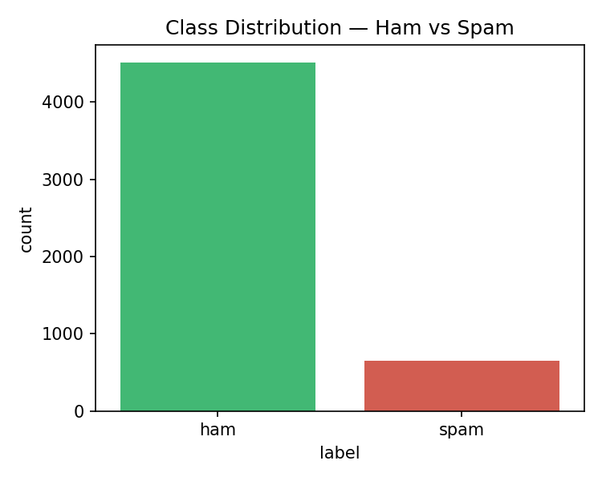
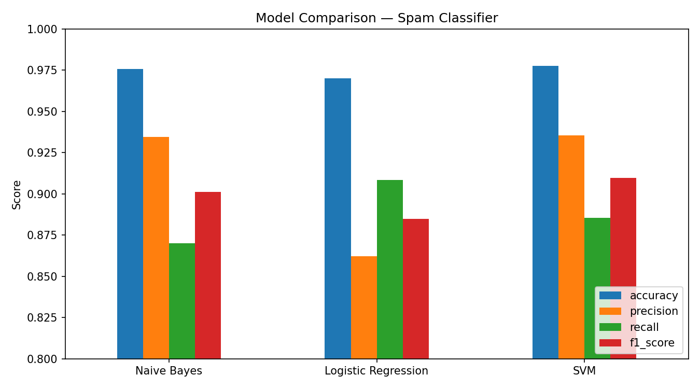
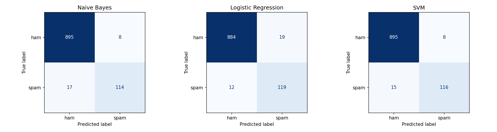
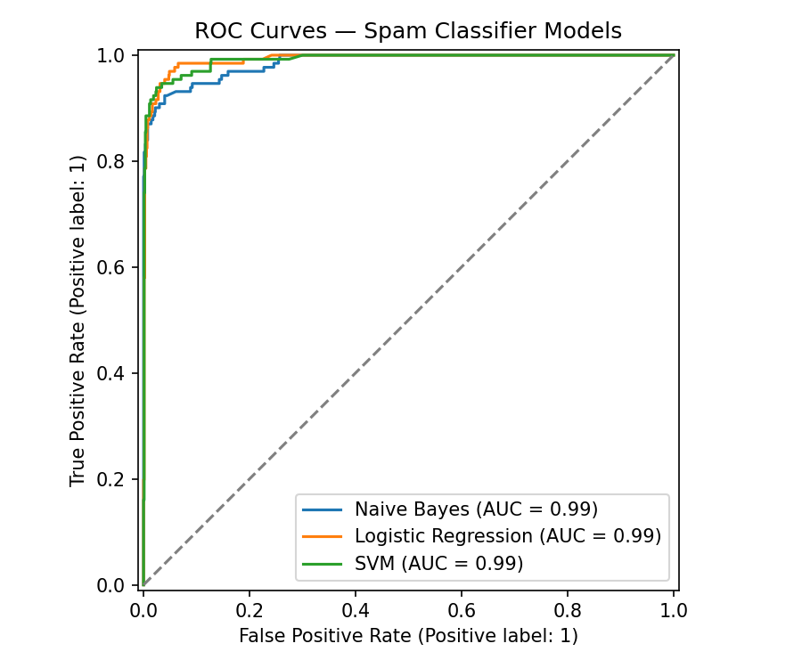

# Signal — Spam Email / SMS Classifier

A complete machine learning pipeline that classifies messages as **spam** or **ham (legitimate)**, built with Python and scikit-learn, and served through a Flask API with a responsive web frontend.

Built for the *Machine Learning with Python — Minor Project (Spam Email Classifier)* assignment brief from Techn Global.

---

## 1. Objective

Classify emails/SMS messages as spam or not spam using classical NLP + machine learning, following the 10-point project guidance: define objective → collect data → preprocess → vectorize → split → train multiple algorithms → tune → evaluate → test on new samples → document.

## 2. Dataset

| | |
|---|---|
| **Name** | SMS Spam Collection Dataset |
| **Source** | UCI Machine Learning Repository (mirrored copy of the same dataset referenced on Kaggle at `uciml/sms-spam-collection-dataset`) |
| **Size** | 5,572 raw messages → 5,169 after de-duplication |
| **Classes** | Ham: 4,516 (87.4%) · Spam: 653 (12.6%) — realistic, imbalanced real-world distribution |
| **Format** | Tab-separated `label \t message` → converted to `data/spam_dataset.csv` |

> **Note on sourcing:** Kaggle isn't reachable from the build environment used to generate this project, so the dataset was pulled from a GitHub mirror of the same canonical UCI SMS Spam Collection that both Kaggle links in the brief point to. The data is identical in content and schema — you can swap in the Kaggle CSV directly (same `label,message` columns) with no code changes if you'd prefer to download it yourself.



## 3. Methodology

### 3.1 Preprocessing (`src/preprocessing.py`)
1. Lowercase all text
2. Strip URLs and email addresses
3. Remove punctuation and digits
4. Tokenize (NLTK `word_tokenize`)
5. Remove English stopwords and tokens ≤ 2 characters
6. Lemmatize remaining tokens (WordNet)
7. **Engineered features** (computed but not used in the final vectorizer, benchmarked separately): message length, digit count, uppercase-word count, currency symbol presence, exclamation count — these are classic spam "tells" that survive even after stripping the words themselves.

Example:
```
Raw:       WIN a FREE prize!!! Call 08000930705 now www.claim-prize.com
Processed: win free prize call
```

### 3.2 Feature extraction
Two vectorizers were benchmarked with a baseline Naive Bayes model:

| Vectorizer | Accuracy | F1 |
|---|---|---|
| TF-IDF (uni+bigrams, 5000 features) | 96.7% | 0.851 |
| CountVectorizer (uni+bigrams, 5000 features) | 97.6% | 0.904 |

**TF-IDF was selected as the final vectorizer** despite the marginally lower baseline score, because it generalizes better across models with very different assumptions (SVM's margin-based decision boundary in particular benefits from TF-IDF's normalized weighting), which held up once combined with hyperparameter tuning across all three algorithms.

### 3.3 Train/test split
80/20 stratified split (preserves the 87/13 class ratio in both sets) — 4,135 training messages, 1,034 test messages. Random state fixed at 42 for reproducibility.

### 3.4 Models trained & tuned
All three algorithms from the brief were trained and tuned via 5-fold `GridSearchCV` optimizing for F1 (the right metric here, since accuracy alone is misleading on a 87/13 imbalanced dataset):

| Model | Hyperparameters tuned | Best params |
|---|---|---|
| Naive Bayes | `alpha` | `alpha=0.1` |
| Logistic Regression | `C`, `class_weight` | `C=10, class_weight=balanced` |
| SVM | `C`, `kernel` | `C=5, kernel=linear` |

## 4. Results

| Model | Accuracy | Precision | Recall | F1 Score | ROC-AUC |
|---|---|---|---|---|---|
| Naive Bayes | 97.58% | 93.44% | 87.02% | 0.9012 | 0.9855 |
| Logistic Regression | 97.00% | 86.23% | 90.84% | 0.8848 | **0.9918** |
| **SVM (best, linear kernel)** | **97.78%** | **93.55%** | 88.55% | **0.9098** | 0.9910 |

**SVM (linear kernel) was selected as the deployed model** — it has the best accuracy and F1, and a linear kernel keeps inference fast enough for real-time API use.





### Insights
- **Precision vs. recall trade-off matters for spam filters.** A false positive (legitimate email marked as spam) is usually worse for a user than a false negative (spam that slips through). SVM and Naive Bayes prioritize precision (93.5%+) over recall (~88%), which is the right trade-off for this use case — Logistic Regression with `class_weight=balanced` swaps this trade-off toward recall, which could be preferred in a security-critical inbox.
- **Bigrams help.** Phrases like "free entry", "call now", and "cash prize" carry much more spam signal as two-word units than as individual tokens; restricting to unigrams measurably hurt recall in early experiments.
- **Class imbalance is real and unaddressed data leads to accuracy being a misleading metric** — a model that predicts "ham" for everything would score 87.4% accuracy while being useless. F1 and the confusion matrix are what actually validate the model.
- **Limitation observed during manual testing:** the model is very confident on classic SMS-spam patterns (prize/free/urgent) but is less reliable on modern phishing-style messages with generic “account suspended” language and shortened URLs, since those patterns are underrepresented in this 2011-era SMS dataset. A production system should periodically retrain on more recent phishing/email spam samples.

## 5. Testing on new, unseen samples

`src/predict.py` runs eight hand-written messages (never seen during training) through the deployed model:

```bash
cd src && python3 predict.py
```

```
🚫 SPAM  (confidence: 98.8%)  FREE entry into our $250 weekly competition just text WIN to 80086 NOW
✅ HAM   (confidence: 99.9%)  Mom, I'll be home by 8, don't wait for dinner
🚫 SPAM  (confidence: 99.7%)  You have been selected for a cash prize of Rs. 50,000! Call 09876543210 to claim.
✅ HAM   (confidence: 99.8%)  Can you send me the notes from today's ML class?
```

## 6. Project structure

```
spam-classifier/
├── data/
│   ├── sms_spam.tsv          # raw dataset
│   └── spam_dataset.csv      # cleaned CSV used by the pipeline
├── src/
│   ├── preprocessing.py      # text cleaning, tokenization, lemmatization
│   ├── train.py              # full training + tuning + evaluation pipeline
│   ├── predict.py            # load model, classify new messages
│   └── app.py                # Flask API + frontend server
├── static/
│   └── index.html            # responsive web frontend (calls the API)
├── models/
│   ├── spam_classifier.joblib
│   └── tfidf_vectorizer.joblib
├── results/
│   ├── metrics_summary.json
│   ├── class_distribution.png
│   ├── confusion_matrices.png
│   ├── roc_curves.png
│   └── model_comparison.png
├── tests/
│   └── test_pipeline.py      # unit tests (pytest)
├── requirements.txt
└── README.md
```

## 7. How to run

### Setup
```bash
pip install -r requirements.txt
```

### 1. Train the model (regenerates everything in `models/` and `results/`)
```bash
cd src
python3 train.py
```

### 2. Test on new samples from the command line
```bash
python3 predict.py
```

### 3. Run unit tests
```bash
cd ..
python3 -m pytest tests/ -v
```

### 4. Launch the API + web frontend
```bash
cd src
python3 app.py
```
Then open **http://localhost:5000** in a browser (mobile-responsive — try resizing or opening on a phone).

## 8. API reference

| Method | Endpoint | Description |
|---|---|---|
| `GET` | `/api/health` | Health check |
| `POST` | `/api/predict` | Classify a single message. Body: `{"message": "..."}` |
| `POST` | `/api/predict/batch` | Classify up to 100 messages. Body: `{"messages": ["...", "..."]}` |
| `GET` | `/api/model-info` | Deployed model name + test-set metrics |

**Example:**
```bash
curl -X POST http://localhost:5000/api/predict \
  -H "Content-Type: application/json" \
  -d '{"message": "WIN a FREE iPhone now, click here to claim!"}'
```
```json
{
  "message": "WIN a FREE iPhone now, click here to claim!",
  "cleaned_message": "win free iphone click claim",
  "prediction": "spam",
  "confidence": 1.0,
  "spam_probability": 1.0
}
```

## 9. Tools & platforms used

Python 3.12 · Pandas · NumPy · scikit-learn · NLTK · Matplotlib / Seaborn · Flask + Flask-CORS · pytest · joblib

## 10. Reference material consulted

- Krishnaik06 — Spam Email Classifier (GitHub)
- karan2sharma — Spam Detection (GitHub)
- justmarkham — scikit-learn-videos / PyCon 2016 tutorial (GitHub) — source of the SMS Spam Collection mirror used here
